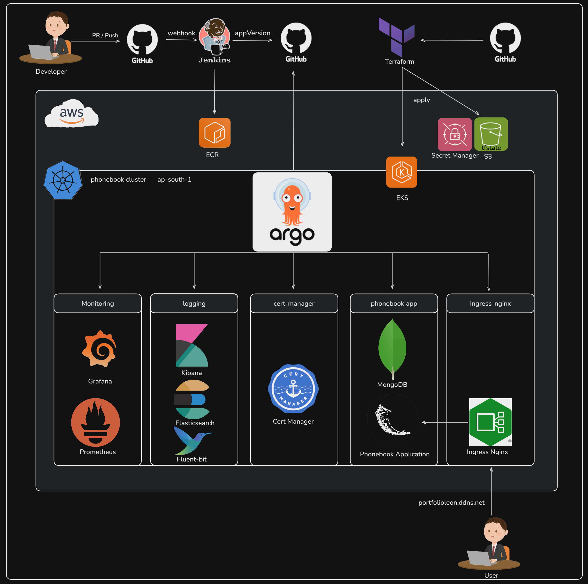
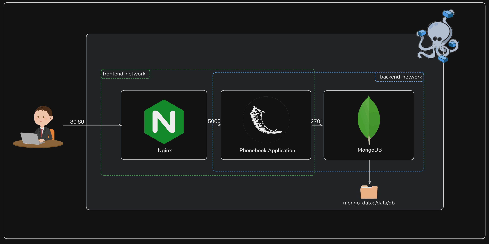
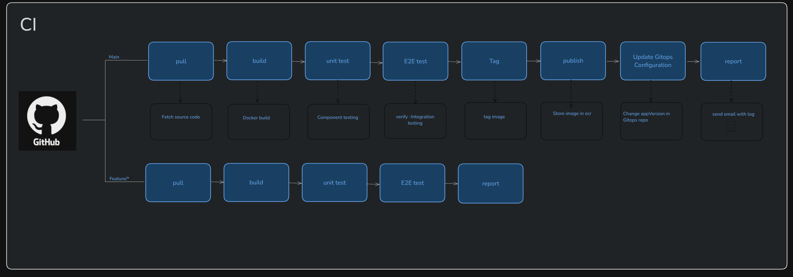
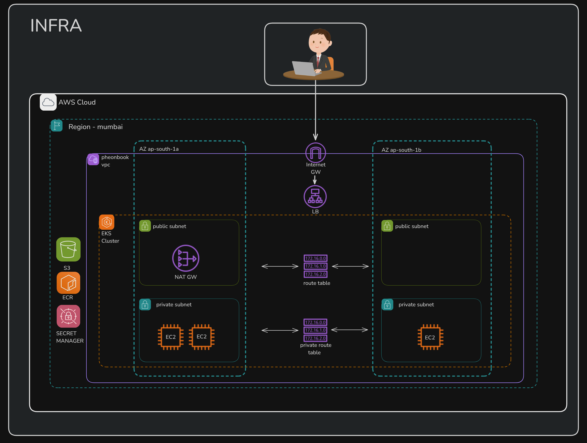
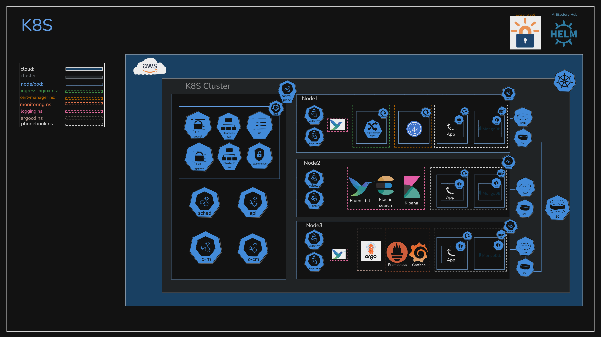

# Cloud-Native Phonebook Application

A comprehensive cloud-native application demonstrating modern DevOps practices, including Infrastructure as Code, GitOps, CI/CD, monitoring, and logging.



## Project Overview

This project implements a full-stack phone book application with a focus on cloud-native architecture and DevOps best practices. It serves as a practical demonstration of:

- Microservices Architecture
- Infrastructure as Code (IaC)
- GitOps-based deployments
- Continuous Integration/Continuous Deployment (CI/CD)
- Containerization
- Cloud-native monitoring and logging
- High availability and scalability

## Repository Structure

```
phonebook-project/
├── phonebook-app/        # Phone book application code
├── infra/     # Terraform IaC configurations
├── gitops-config/     # Argo CD and Kubernetes configurations
└── Images/            # Architecture and flow diagrams, as well as general images
```

## Key Features

### Application
- RESTful API built with Flask
- MongoDB database backend
- Responsive web interface
- Dark/Light theme support
- Prometheus metrics integration

### Infrastructure
- AWS EKS-based Kubernetes cluster
- Modular Terraform configuration
- High-availability setup across multiple AZs
- Secure networking with public/private subnets

### DevOps Pipeline
- Jenkins CI/CD pipeline
- GitOps with Argo CD
- AWS ECR for container registry
- Automated testing

### Monitoring & Logging
- Prometheus & Grafana for monitoring
- EFK (Elasticsearch, Fluent Bit, Kibana) stack for logging
- Custom metrics and dashboards
- Real-time monitoring and alerts

## Getting Started

### Prerequisites
- AWS Account with appropriate permissions
- Terraform >= 1.0.0
- kubectl
- Docker
- Git

### Quick Start

1. Clone the repository:
   ```bash
   git clone https://github.com/yourusername/phonebook-project.git
   cd phonebook-project
   ```

2. Follow setup instructions in each component's README:
   - [Application Setup](phonebook-app/README.md)
   - [Infrastructure Setup](infra/README.md)
   - [GitOps Setup](gitops-config/README.md)

## Architecture

### 3-tier Application


### CI/CD Flow


### Infrastructure Architecture


### Kubernetes Architecture



## Component Details

### Application Layer
- Flask-based REST API
- MongoDB for data persistence
- Responsive frontend with vanilla JavaScript
- Docker containerization

### Infrastructure Layer
- EKS cluster with autoscaling
- VPC with public/private subnets
- Security groups and IAM roles
- Load balancing and SSL termination

### DevOps Layer
- Jenkins pipeline with multiple stages
- Argo CD for GitOps deployments
- Prometheus/Grafana monitoring
- EFK logging stack

## License

This project is licensed under the MIT License - see the [LICENSE](LICENSE) file for details.

